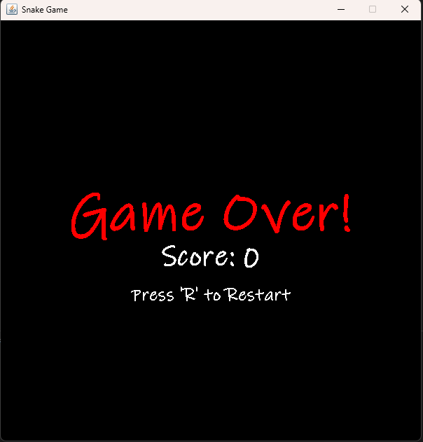

 Snake Game

A classic Snake game where the player controls a snake to eat food and grow longer, while trying to avoid collisions with the walls and its own body.

 

 How to Play

   Objective: Eat the red food pellets to grow your snake and increase your score. The game ends if the snake hits a wall or runs into its own body.
   Controls:
       Arrow Up: Move the snake up.
       Arrow Down: Move the snake down.
       Arrow Left: Move the snake left.
       Arrow Right: Move the snake right.
       R: Restart the game after a "Game Over".

 How to Run

This is a Java Swing application. You need the Java Development Kit (JDK) installed to compile and run the game.

 Prerequisites

   Java JDK (version 8 or higher) - [Download here](https://www.oracle.com/java/technologies/downloads/)

 Running the Game

1.  Compile the code:
    Open a terminal or command prompt in the root directory of the project.
    
    If Java is in your PATH:
    ```bash
    javac -d bin src/.java
    ```
    
    If Java is not in your PATH (Windows):
    ```powershell
    & "C:\Program Files\Java\jdk-25\bin\javac.exe" -d bin src/.java
    ```
    (Adjust the JDK version path if you have a different version installed)

2.  Run the game:
    
    If Java is in your PATH:
    ```bash
    java -cp bin com.yourcompany.snakegame.Main
    ```
    
    If Java is not in your PATH (Windows):
    ```powershell
    & "C:\Program Files\Java\jdk-25\bin\java.exe" -cp bin com.yourcompany.snakegame.Main
    ```

The game window will open automatically. Use the arrow keys to control the snake!
